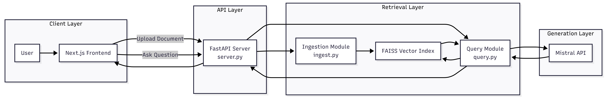

# Medibotix

A Retrieval-Augmented Generation (RAG) based medical report assistant built using a Next.js (TypeScript) frontend and a Python backend.

**Live Demo:** [https://medibotix.vercel.app](https://medibotix.vercel.app)

## Overview

Medibotix allows users to upload medical documents, ingest them into a vector index, and query them using a retrieval pipeline combined with the Mistral large language model. The system follows a modular RAG pipeline with clear separation between frontend and backend components.

## Architecture Overview

Medibotix follows a modular RAG pipeline:

1. Document upload from frontend
2. Backend ingestion and embedding
3. Vector storage
4. Query-based similarity retrieval
5. Context injection into Mistral
6. Generated response returned to frontend

The frontend and backend are fully separated and communicate via REST APIs.

## Repository Structure

### Backend

```
backend/
├── ai-service/
├── config.py
├── ingest.py
├── query.py
├── server.py
├── requirements.txt
└── .gitignore
```

#### File Responsibilities

- **`server.py`** - Entry point of the backend application. Defines API routes and initializes the FastAPI server.
- **`config.py`** - Handles environment variables and configuration (including MISTRAL_API_KEY).
- **`ingest.py`** - Responsible for document ingestion: reads uploaded medical reports, generates embeddings, and stores vectors in the index.
- **`query.py`** - Handles user queries: performs similarity search over stored embeddings, constructs augmented prompt, calls Mistral API, and returns generated response.
- **`ai-service/`** - Contains AI-related utilities and orchestration logic.

### Frontend

```
frontend/
├── app/
│   ├── chat/
│   ├── upload/
│   ├── page.tsx
│   ├── layout.tsx
│   └── globals.css
├── components/
│   └── ThemeToggle.tsx
├── lib/
│   ├── api.ts
│   ├── utils.ts
│   └── ThemeContext.tsx
├── public/
├── next.config.ts
├── package.json
├── postcss.config.mjs
└── eslint.config.mjs
```

#### Folder Responsibilities

- **`app/`** - Next.js App Router structure
  - `chat/` handles user interaction and query interface
  - `upload/` handles document upload
  - `layout.tsx` defines global layout
  - `page.tsx` defines main landing page
- **`components/`** - Reusable UI components
- **`lib/api.ts`** - Centralized API communication layer with backend
- **`lib/ThemeContext.tsx`** - Manages application theme state

## Core Features

- Document upload and ingestion
- Vector-based similarity retrieval
- Context-aware LLM responses
- Mistral API integration
- Clean separation between ingestion and query pipelines
- Next.js App Router frontend

## Technology Stack

### Frontend
- Next.js (App Router)
- TypeScript
- React
- Tailwind CSS

### Backend
- Python
- FastAPI
- FAISS (vector similarity search)
- NumPy
- Uvicorn

### AI
- Mistral API
- Retrieval-Augmented Generation pipeline

### Deployment
- **Frontend:** Vercel
- **Backend:** Render

## Backend Workflow

### Ingestion Flow

1. Receive uploaded document
2. Extract text
3. Split into manageable chunks
4. Generate embeddings
5. Store embeddings in vector index

**Handled by:** `ingest.py`

### Query Flow

1. Receive user question
2. Generate embedding for query
3. Perform similarity search
4. Retrieve relevant document chunks
5. Construct augmented prompt
6. Call Mistral API
7. Return generated response

**Handled by:** `query.py`




## Environment Variables

Backend requires:

```bash
MISTRAL_API_KEY=your_api_key_here
```

This must be configured locally and in production.

## Local Development

### Backend

```bash
cd backend
pip install -r requirements.txt
uvicorn server:app --reload --port 8000
```

### Frontend

```bash
cd frontend
npm install
npm run dev
```

Make sure the frontend API base URL matches the backend port.

## Design Principles

- Clear separation of ingestion and query logic
- Stateless API design
- Modular RAG pipeline
- Environment-driven configuration
- Frontend independent of AI logic
